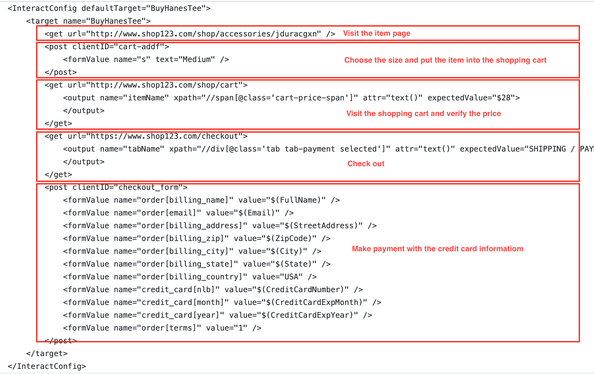

# NetInteractor
[](https://travis-ci.org/kerryjiang/NetInteractor)
[](https://www.nuget.org/packages/NetInteractor.Core/)

Web operation automation library in C# (.NET Core)

It can be used for the purposes below:
* Web white-box test automation;
* Web operation automation;
* ...

Features:
* Xml as script;
* Accept input parameters;
* Extract parameters from the responses of middle steps (output parameters);
* Basic work flow controlling (if);


## The Automation Script




## Execute the script
```csharp
var config = ConfigFactory.DeserializeXml<InteractConfig>("Scripts/Shop.config");

var executor = new InterationExecutor();

var inputs = new NameValueCollection();

inputs["CreditCardNumber"] = "0123456789ABCD";
inputs["CreditCardExpMonth"] = "04";
inputs["CreditCardExpYear"] = "2021";
// more input parameters
// ...

var result = await executor.ExecuteAsync(config, inputs);

```
